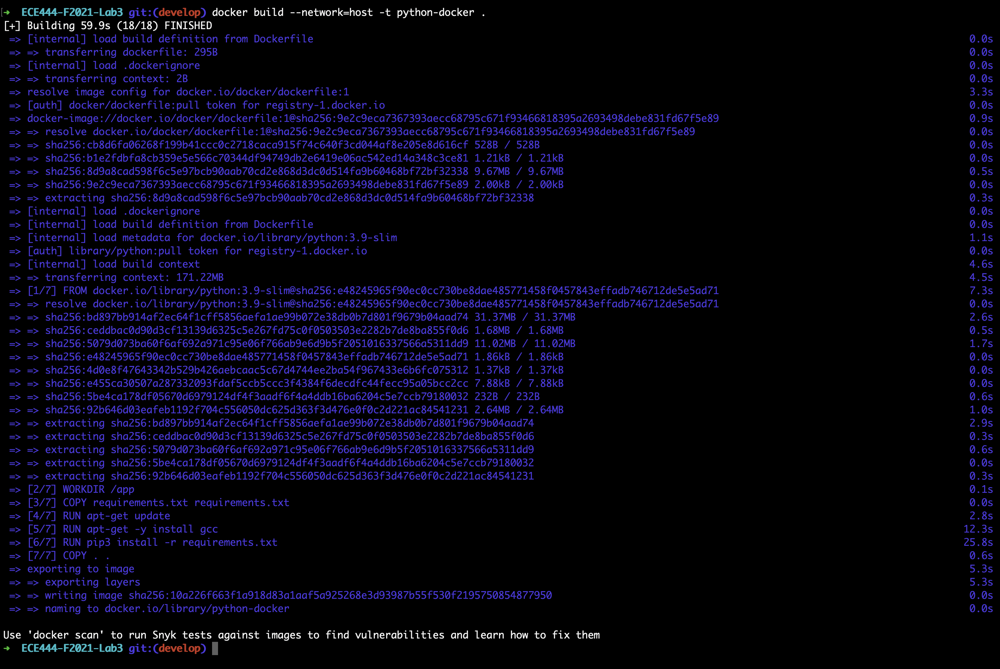

# ECE444-F2021-Lab3

This repo is a clone of https://github.com/nelaturuk/education_pathways.

## Submission

### Activity 1

### Activity 2

### Activity 3

### Activity 4

1. 
2. 

### Activity 5

1.  **Functional Requirement**

    Currently, the education pathways application has one main function: performing a search across courses in the database based on filters, and returning the result(s) of the search. I believe that this application can, and should, be extended to allow for user profiles (and in turn, authentication).

    User profiles will allow users to perform searches and save courses that they are interested in. This functionality has obvious positives for a user and sets up base functionality to be advanced through next steps (i.e. allowing users to save courses and make multiple profiles, creating schedules based on saved courses).

2.  **Non-Functional Requirement**

    After investigation, I have found that the application takes just under two seconds to perform a search, and then some additional time to display the results. Ideally, this search should be performed in under 1 second (improvement on **performance**), and the UX should be more responsive, letting the user know that their button interaction has been registered (improvement on **usability**).
